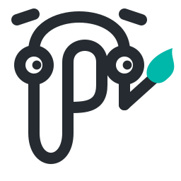

<div align="center">



# PaintAI

**A canvas your coding agent can actually see.**

Annotate real screenshots, build mockups, draw diagrams. Then let Claude Code or
Copilot read the same canvas you are drawing on, and write to it.

[](https://github.com/jams4code/paintai/actions/workflows/ci.yml)
[](https://github.com/jams4code/paintai/actions/workflows/security.yml)
[](LICENSE)

</div>

---

## Status: early. Phases 0 to 3 done.

The canvas works, and an agent can drive it. What is missing is the in-app chat
panel, the icon library, and the crop/redact tools. Everything below that is
marked done has been built and rendered, not just planned.

It is public this early on purpose. The design decisions are written down in
[PLAN.md](PLAN.md) and they are still cheap to argue with. If you think one of
them is wrong, now is the moment to say so, not after ten thousand lines are
built on top of it.

| Phase | What                              | State   |
| ----- | --------------------------------- | ------- |
| 0     | Toolchain, scaffold, brand        | Done    |
| 1     | Canvas, image paste, draw, export | Done    |
| 2     | `scene-ops` domain core           | Done    |
| 3     | MCP server and agent skill        | Done    |
| 4     | In-app chat panel                 | Next    |
| 5     | Icons and layout intelligence     | Planned |
| 6     | Crop, redact, scaled export       | Planned |

---

## Why this exists

Coding agents are blind when they touch anything visual.

Claude Code will happily write a background-removal loop over forty product
shots and have no idea the mask ate the shadow on twelve of them. It cannot see
a mockup you drew. It cannot point at a region. It fires commands into the dark
and reports success. That gap is the entire reason this project exists.

The human half is just as broken. Annotating a screenshot today means opening
Paint, drawing a red box, saving to Downloads, and dragging the file back into a
chat window.

PaintAI is one canvas that both sides share.

### About the paperclip

Clippy lived inside your document, watched what you were doing, and could not
actually do anything. It observed and it suggested. PaintAI sits in the same
place with the same posture, except this one can read your canvas, draw on it,
and hand the result to your compiler.

The mascot is an original character, not Microsoft's asset. Its silhouette is a
wire-bent **P**, which is ours, rather than a paperclip, which is not.

---

## Try it

### Download

Prebuilt Windows installers and a portable `.exe` are attached to every
[release](https://github.com/jams4code/paintai/releases). Download, run, done.
No account, no network, no telemetry.

macOS and Linux builds are produced by CI but are not yet tested by a human.
Treat them as unsigned and unverified.

### Build from source

You need [Node 20+](https://nodejs.org), [pnpm 9+](https://pnpm.io), and a
[Rust stable toolchain](https://rustup.rs).

On Windows you also need the Visual Studio Build Tools, because Rust's MSVC
target shells out to `link.exe`. `rustup` does not install those. Verify with:

```bash
cargo new --bin /tmp/probe && cd /tmp/probe && cargo build
```

If that links, you are ready.

```bash
git clone https://github.com/jams4code/paintai.git
cd paintai
pnpm install
pnpm dev          # run in development
pnpm validate     # run every check CI runs
pnpm release      # produce installers in apps/desktop/src-tauri/target/release/bundle
```

---

## How it works

```
paintai/
  apps/desktop/          Tauri v2 shell. React renderer + Rust backend.
  packages/scene-ops/    Pure domain core. No React, no Tauri, no MCP.
  packages/protocol/     Zod schemas shared by MCP tools and the prompt bar.
  packages/icons/        Offline icon index.
  brand/                 Logo system and its build pipeline.
```

Three decisions carry the whole design.

**Non-destructive vector over raster.** Paint bakes your strokes into the pixels.
PaintAI keeps the source image untouched and puts your marks above it, so every
one stays movable and deletable. It flattens only at export. This is strictly
better for annotating a real screenshot, and it is why this is not a pixel editor.

**`scene-ops` is the core and depends on nothing.** The React app depends inward
on it. The MCP layer depends inward on it. Neither knows the other exists. A
human dragging a box and an agent calling a tool go through the same pure
functions. If you find yourself importing React inside `scene-ops`, the boundary
has broken.

**The agent never writes raw scene JSON.** It writes a simplified spec and
`scene-ops` hydrates it into valid elements with correct containers and arrow
bindings:

```jsonc
{ "kind": "box", "x": 100, "y": 200, "w": 300, "h": 40, "label": "Email" }
{ "kind": "connect", "from": "box_1", "to": "box_2", "label": "submits" }
```

Skip that hydration layer and a model will get the binding fields wrong every
time. The result looks correct in a screenshot and falls apart the moment a
human drags a shape. That layer is the hard part of this project.

Full reasoning, including what was deliberately rejected, is in [PLAN.md](PLAN.md).

---

## Explicit non-goals

These are refused on purpose. Please do not open PRs for them.

- No pixel engine. No layers, masks, blend modes, channels, or filters.
- No image generation. No GPU dependency, no API keys, no per-call cost.
- No realtime multiplayer, no cloud sync, no accounts, no telemetry.
- No web build. This is a local desktop application.

---

## Connecting your agent

With PaintAI open, one command:

```bash
claude mcp add --transport http paintai http://127.0.0.1:7331/mcp
```

Then ask it things like _"look at the canvas and build that as a React
component"_ or _"add a login form mockup at 0,0"_.

Copilot, the agent skill, the full tool list and the security notes are in
[docs/agents.md](docs/agents.md).

---

## Contributing

Genuinely wanted, and the early phases are the best time. Start with
[CONTRIBUTING.md](CONTRIBUTING.md). It has the exact commands, what CI checks,
and how to pick something to work on.

Good first contributions are labelled
[`good first issue`](https://github.com/jams4code/paintai/labels/good%20first%20issue).

Security issues go to [SECURITY.md](SECURITY.md), never to a public issue.

---

## License

[MIT](LICENSE) © Jamal Abdelkhalek

Built on [Excalidraw](https://github.com/excalidraw/excalidraw) (MIT) and
[Tauri](https://tauri.app) (MIT / Apache-2.0).
